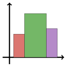

<picture><source srcset="docs/src/assets/logo-dark.svg" media="(prefers-color-scheme: dark)"></picture>
# AutoHist.jl

[](https://github.com/oskarhs/AutoHist.jl/actions/workflows/CI.yml?query=branch%3Amain)
[](https://codecov.io/gh/oskarhs/AutoHist.jl)
[](https://oskarhs.github.io/AutoHist.jl/stable/)
[](https://oskarhs.github.io/AutoHist.jl/dev/)
[](https://joss.theoj.org/papers/d354cd6d6ecfa7a3c4e87d9fa83f1e16)

A pure Julia implementation of state-of-the-art automatic regular and irregular histogram methods.

## Introduction
Most default histogram plotting software only support a few regular automatic histogram procedures and use very simple plug-in rules by default to compute the the number of bins, frequently leading to poor density estimates for non-normal data \[cf. [Birgé and Rozenholc (2006)](#birge2006bins), [Simensen et al. (2025)](#simensen2025random)\]. The purpose of this software package is to offer the user a fast and simple-to-use implementation of more sophisticated regular and irregular histogram procedures. Our package supports a variety of methods including those based on asymptotic risk minimization, leave-one-out cross-validiation, penalized maximum likelihood and fully Bayesian approaches.

## Installation
Installing the package is most easily done via Julia's builtin package manager `Pkg`. This package is part of the Julia general registry, so the installation can be done via the two following lines of code:
```julia
using Pkg
Pkg.add("AutoHist")
```

## Quick start

To get started, we illustrate the basic use of the package by fitting histograms to a normal random sample with an automatic selection of the histogram partition.

```julia
using AutoHist
x = randn(10^6)
h1 = fit(AutomaticHistogram, x)
```

Several rules are available to select the histogram partition, and can be controlled through the use of the `rule` positional argument. For instance, a regular histogram based on maximizing the AIC can be fit as follows:
```julia
h2 = fit(AutomaticHistogram, x, AIC())
```
Alternatively, we can use the `autohist(x, rule; kwargs...)` syntax, which serves as an alias for `fit(AutomaticHistogram, x, rule; kwargs...)`. The code snippet below shows how to fit the AIC-based histogram using this method.
```julia
h2 = autohist(x, AIC())
```

A detailed exposition of the keyword arguments passed to `fit` and `autohist` can be found by typing `?fit` in the repl or in the [API documentation](https://oskarhs.github.io/AutoHist.jl/stable/api/). A detailed description of all methods currently implemented in AutoHist.jl can be found in the [methods documentation](https://oskarhs.github.io/AutoHist.jl/stable/methods/).

#### Plotting
The fitted histograms can be displayed through the [Plots.jl](https://github.com/JuliaPlots/Plots.jl) or [Makie.jl](https://github.com/MakieOrg/Makie.jl) packages as follows:

```julia
import Plots, CairoMakie, Makie
Plots.plot(h1)
Makie.plot(h1)
```

It is also possible to draw an automatic histogram by calling a supported plotting function directly:
```julia
Plots.histogram(x, AIC())
Makie.hist(x, AIC())
```
For more details on the plotting capabilities offered by AutoHist.jl, see the [plotting tutorial](https://oskarhs.github.io/AutoHist.jl/stable/examples/plotting/).

## Supported criteria

The argument `rule` determines the method used to construct the histogram for both of the histogram functions. The rule used to construct the histogram can be changed by setting `rule` equal to a symbol indicating the method to be used, e.g. `BIC()` which yields an automatic regular histogram based on the BIC criterion.

The default method is the Bayesian approach of [Simensen et al. (2025)](#simensen2025random), corresponding to keyword `rule=RIH()`.
A detailed description of the supported methods can be found in the [methods documentation](https://oskarhs.github.io/AutoHist.jl/stable/methods/).

## Contributing
If you encounter a bug when using this software or have a feature request, then feel free to open a github issue.

Coding contributions are also very much welcome, especially if you are looking to add a new automatic histogram method or a new algorithm for fitting an already-implemented bin selection rule. To make sure that your proposed new feature is a good fit for the AutoHist package, please open a new issue to discuss how your contribution could elevate AutoHist.jl.

## References
<a name="simensen2025random"></a> Simensen, O. H., Christensen, D. & Hjort, N. L. (2025). Random Irregular Histograms. _arXiv preprint_. doi: [10.48550/ARXIV.2505.22034](https://doi.org/10.48550/ARXIV.2505.22034)

<a name="birge2006bins"></a> Birgé, L., & Rozenholc, Y. (2006). How many bins should be put in a regular histogram. _ESAIM: Probability and Statistics_, **10**, 24–45. doi: [10.1051/ps:2006001](https://doi.org/10.1051/ps:2006001)
